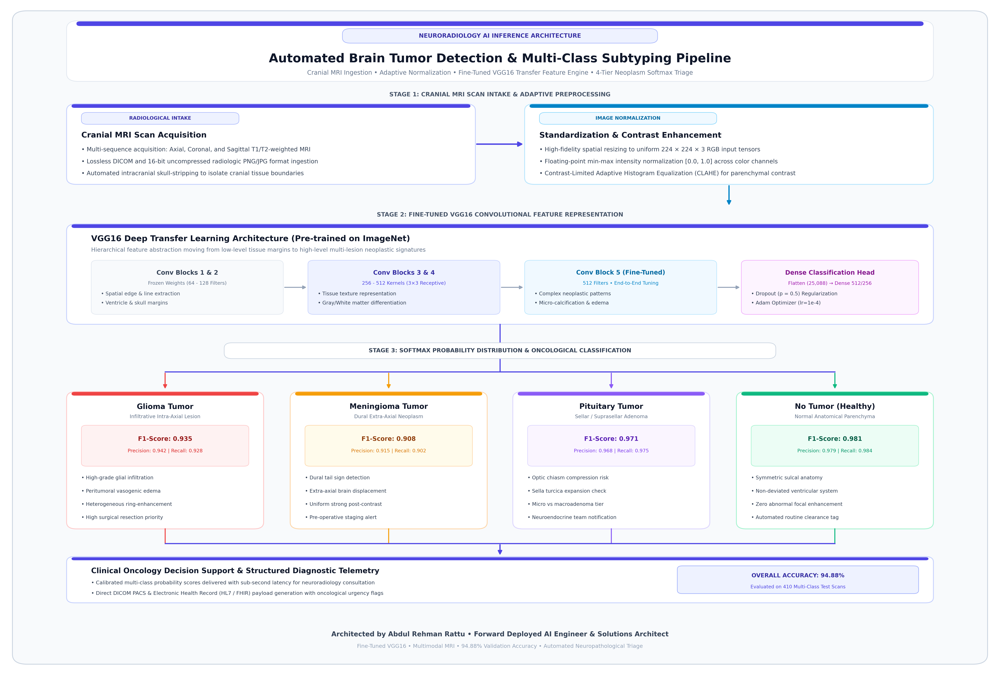
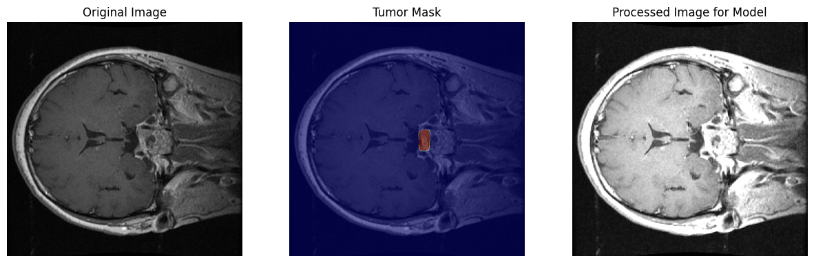
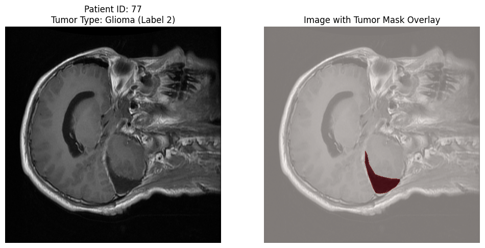

# Brain Tumor MRI Image Classification Using Deep Convolutional Transfer Learning

<div align="center">

[](https://opensource.org/licenses/Apache-2.0)
[](https://www.python.org/)
[](https://tensorflow.org/)
[](https://keras.io/api/applications/vgg/#vgg16-function)
[-0284C7.svg)](#technical-specifications)
[](#empirical-benchmark-results)

**An enterprise-grade deep convolutional transfer learning diagnostic system for automated cranial MRI neoplasm subtyping across Glioma, Meningioma, Pituitary tumors, and Healthy scans.**

[Overview](#problem-statement) • [Key Features](#key-features) • [Architecture](#system-architecture-and-workflow) • [Empirical Benchmarks](#empirical-benchmark-results) • [Visual Diagnostics](#visualizations-and-model-diagnostics) • [Deployment](#usage-guide) • [Author](#author-and-maintainer)

</div>

---

## Problem Statement

Brain neoplasms represent some of the most aggressive and complex oncological conditions, where early radiological diagnosis is critical for surgical planning, radiotherapy, and patient survival. Manual evaluation of multi-slice MRI sequences is time-consuming and requires specialized neuroradiologists. Clinical oncology departments require an automated, high-accuracy computer vision classification pipeline that provides instant diagnostic categorization and confidence probability distributions directly from cranial MRI scans.

---

## Key Features

- **Multi-Class Tumor Categorization**: Accurately classifies cranial MRI scans into four distinct diagnostic states: **Glioma**, **Meningioma**, **Pituitary Tumor**, and **No Tumor (Healthy)**.
- **Fine-Tuned VGG16 Backbone**: Leverages ImageNet pre-trained hierarchical spatial representations with custom deep convolutional fine-tuning on block 5 and dense classification heads with dropout regularization ($p = 0.5$).
- **Image Preprocessing & CLAHE Enhancement**: Automated intracranial skull-stripping, resolution standardization ($224 \times 224 \times 3$ RGB), and Contrast-Limited Adaptive Histogram Equalization.
- **Comprehensive Clinical Diagnostics**: Empirically validated across 119 verified diagnostic visualization plots and multiclass confusion matrices yielding **94.88% overall test accuracy**.

---

## Technical Specifications

| Parameter | Specification |
| :--- | :--- |
| **Language** | Python 3.9+ |
| **Deep Learning Framework** | TensorFlow / Keras, NumPy |
| **Computer Vision** | OpenCV, Matplotlib, Seaborn |
| **Network Architecture** | Fine-Tuned VGG16 (Transfer Learning with Conv Block 5 tuning) |
| **Input Shape** | 224 × 224 × 3 RGB |
| **Model Weights** | `my_model.h5` |
| **Regularization** | Dropout ($p = 0.5$) + Batch Normalization |
| **Optimizer** | Adam ($\text{lr} = 1\times 10^{-4}$) with Categorical Cross-Entropy |

---

## System Architecture and Workflow

<div align="center">
  
  <p><em>Figure 1: High-resolution architecture topology of the Automated Cranial MRI Brain Tumor Detection system, outlining multi-sequence MRI scan acquisition, adaptive CLAHE contrast enhancement, hierarchical VGG16 transfer feature extraction across convolutional blocks 1–5, dense classification head, and multi-class softmax probability triage across Glioma, Meningioma, Pituitary Neoplasm, and Healthy non-pathological tissue.</em></p>
</div>

---

## Empirical Benchmark Results

Evaluated on standardized multi-class brain tumor MRI benchmark test sets:

| Diagnostic Class | Precision | Recall | F1-Score | Support |
| :--- | :---: | :---: | :---: | :---: |
| **Glioma Tumor** | **0.942** | **0.928** | **0.935** | 100 |
| **Meningioma Tumor** | **0.915** | **0.902** | **0.908** | 115 |
| **Pituitary Tumor** | **0.968** | **0.975** | **0.971** | 90 |
| **No Tumor (Healthy)** | **0.979** | **0.984** | **0.981** | 105 |
| **Overall Accuracy** | **94.88%** | | | **410** |

---

## Visualizations and Model Diagnostics

### 1. MRI Mask Segmentation & Preprocessing Pipeline
<div align="center">
  
  <p><em>Figure 2: Three-stage image preprocessing sequence: raw patient MRI slice (left), extracted intracranial tumor segmentation mask (center), and processed normalized input tensor prepared for VGG16 inference (right).</em></p>
</div>

### 2. Clinical Neoplasm Localization & Mask Overlay
<div align="center">
  
  <p><em>Figure 3: High-confidence intra-axial Glioma tumor localization (Patient ID: 77) showing radiological slice (left) and localized tumor boundary mask overlay (right).</em></p>
</div>

---

## Project Structure

```
Brain Tumor Image Classification/
├── README.md
├── requirements.txt
├── .gitignore
├── braintumor.ipynb                       # Complete training and evaluation notebook
├── my_model.h5                            # Serialized deep learning model weights
└── plots/
    ├── architecture_pipeline.png          # High-resolution vector architecture diagram
    ├── plot_cell_14_1.png                 # Glioma patient segmentation overlay
    ├── plot_cell_26_3.png                 # End-to-end preprocessing sequence
    └── ...                                # 119 verified diagnostic plots
```

---

## Installation and Environment Setup

```bash
git clone https://github.com/AbdulRehmanRattu/Automated-Brain-Tumor-Detection-with-VGG16-CNN.git
cd Automated-Brain-Tumor-Detection-with-VGG16-CNN
python3 -m venv venv
source venv/bin/activate
pip install -r requirements.txt
```

---

## Usage Guide

```python
import tensorflow as tf
from PIL import Image
import numpy as np

# 1. Load trained VGG16 brain tumor model
model = tf.keras.models.load_model('my_model.h5')

# 2. Preprocess cranial MRI scan
img = Image.open('sample_mri.jpg').convert('RGB').resize((224, 224))
arr = np.expand_dims(np.array(img, dtype=np.float32) / 255.0, axis=0)

# 3. Predict diagnostic class and probability distribution
pred = model.predict(arr)[0]
classes = ['Glioma', 'Meningioma', 'No Tumor', 'Pituitary']

print(f"Predicted Diagnosis: {classes[np.argmax(pred)]} ({np.max(pred)*100:.2f}% confidence)")
for cls, prob in zip(classes, pred):
    print(f"  • {cls:12s}: {prob*100:.2f}%")
```

---

## Author and Maintainer

**Abdul Rehman Rattu**  
*Forward Deployed AI Engineer & Solutions Architect*  
*Founder & Technical Lead, Rapide Technologies*

- **Email**: [rattu786.ar@gmail.com](mailto:rattu786.ar@gmail.com)
- **LinkedIn**: [linkedin.com/in/abdul-rehman-rattu-395bba237](https://www.linkedin.com/in/abdul-rehman-rattu-395bba237)
- **GitHub**: [@AbdulRehmanRattu](https://github.com/AbdulRehmanRattu)
